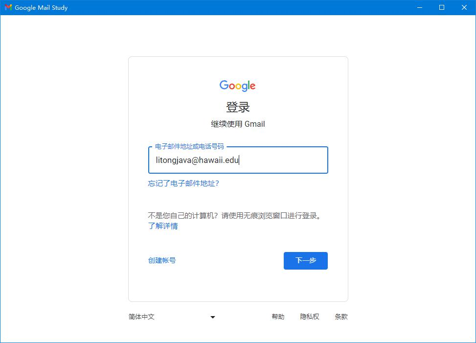
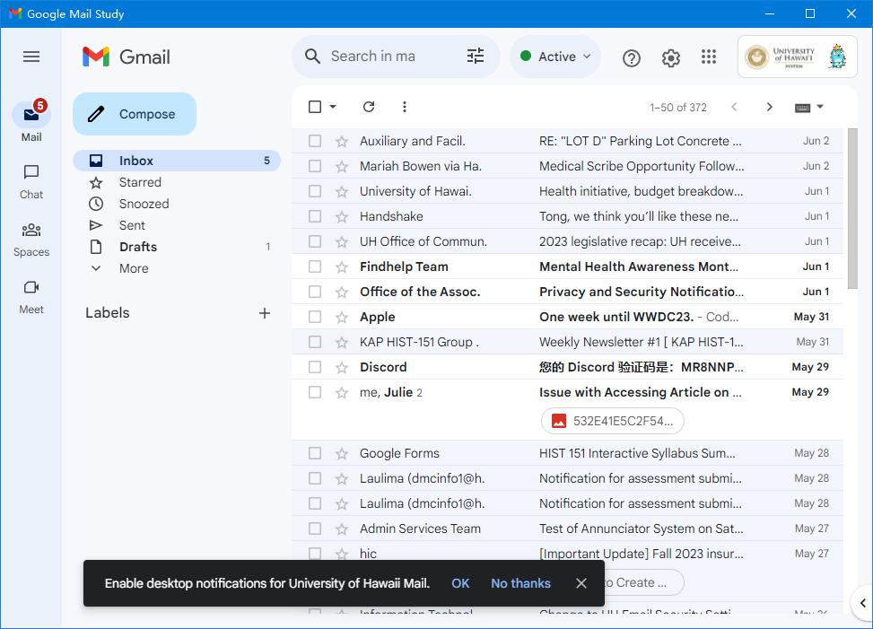

# tauri-google-mail-admin
使用rust语言的tarui框架将Google Mail 网页版 封装为的Google Mail 客户端GUI ,这个是admin版本  
The tarui framework of rust language is used to encapsulate the Google Mail web version as the Google Mail client GUI,this is admin version

